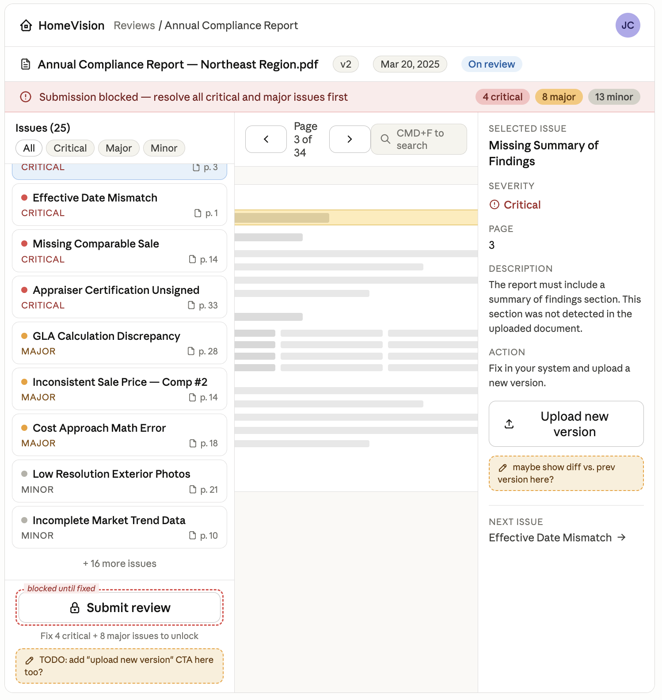
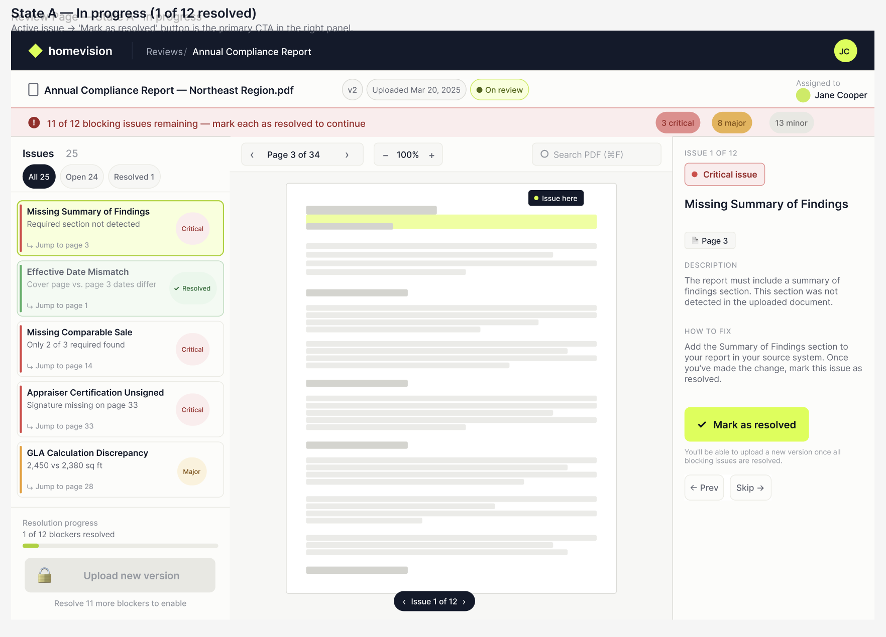
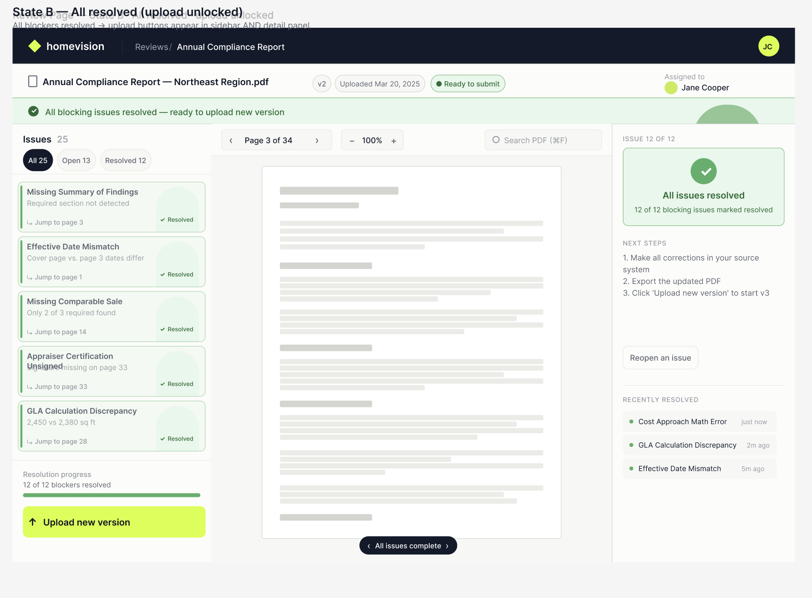
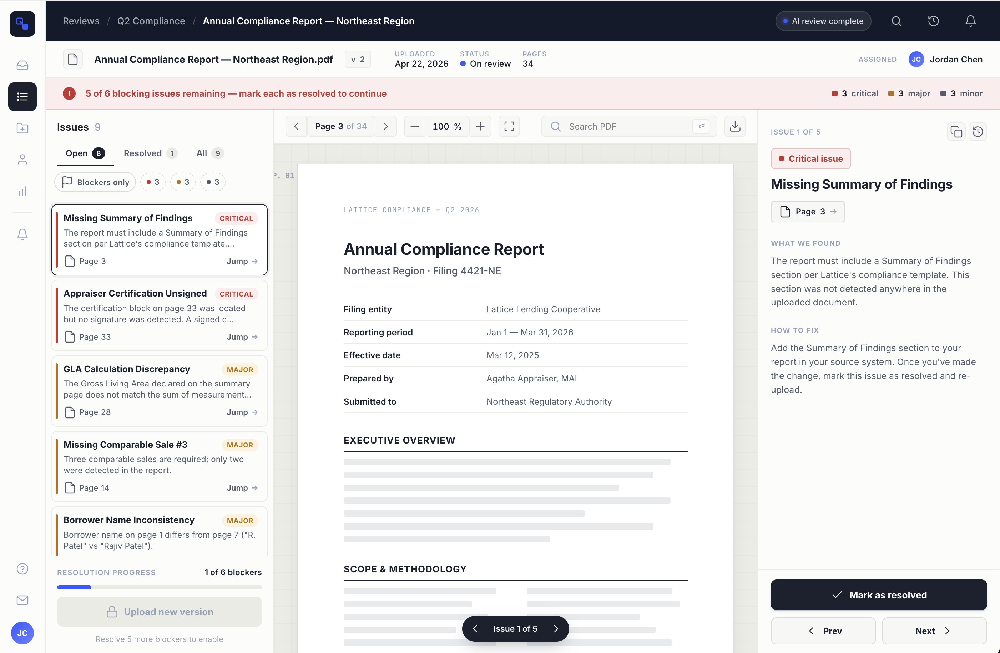
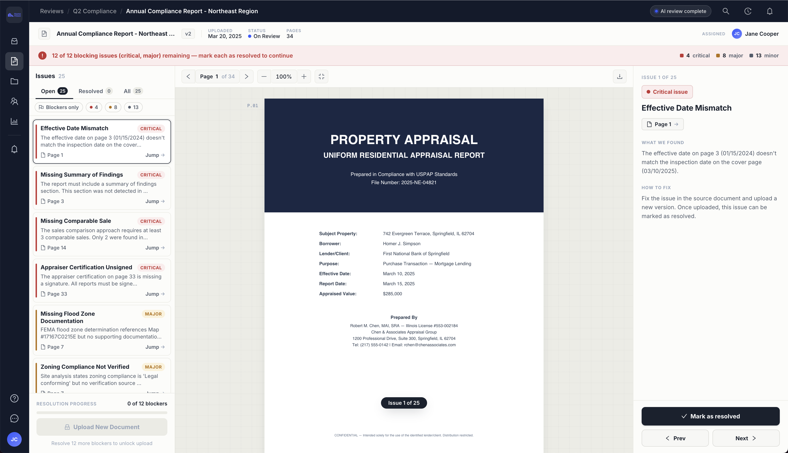

# Document Review Page

A React + TypeScript document review page for validation of underwriting documents.

## Running the app

```bash
npm install
npm run dev
```

The app opens at **http://localhost:5173**. No backend required, as the mock API response is loaded directly from `src/data/review_mock.json`.

## Stopping the app

Press `Ctrl+C` in the terminal where `npm run dev` is running.

## Building for production

```bash
npm run build
```

Output is written to `dist/`.

## Approach

I decided that having a "to-do" system would help the user go through the blocking issues and keep track of which ones need to be addressed next. We keep users from uploading until they address all blocking issues. I also wanted to give the user a sense of progress, so I added a progress bar that shows how many blocking issues are left.

## Design to implementation workflow

1. Read project requirements, mock data, and example PDF. Combined learnings into a CLAUDE.md file using a Claude project for context.
2. Generated a first mockup UI from CLAUDE.md.



3. Used the mockup and Claude with Figma to produce a Figma design file (fairly rough start), then adjusted to fit the functionality requirements.




4. Used Claude Design, combining elements of the company design system (from their website and images of their tooling on LinkedIn) along with specific instructions to Claude on how the UI should function.



5. Used Claude Design's mockup UI as a starting point in Claude Code, from which I implemented the final product, and iterated on the code as needed to maintain a good user experience and code quality.



## Tech stack

- React 18 + TypeScript (Vite)
- react-pdf — inline PDF rendering with text layer
- Ant Design — UI icon components
- Claude Code + Claude Design — AI tools for UI design and implementation
